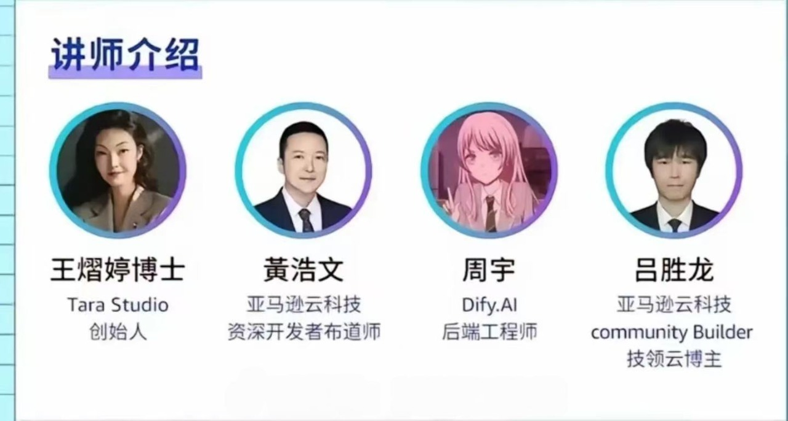
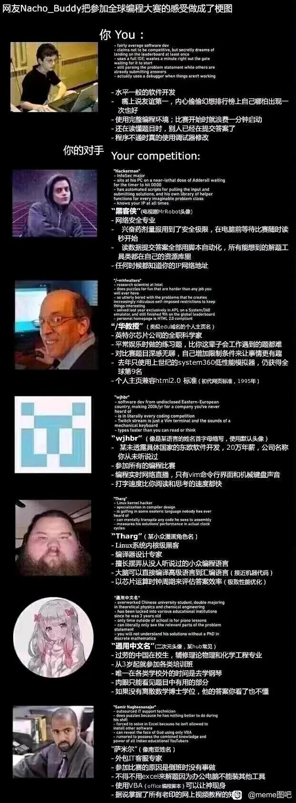
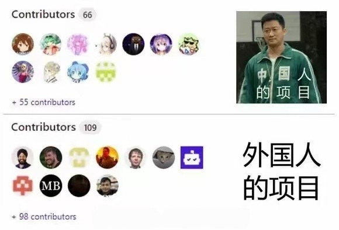

# 关于图灵老祖对计算机一脉影响的讨论

最近刷到了好多这样的评论

> 虚假的二次元社团：二次元社
> 真正的二次元社团：计算机社，ACM-ICPC校队
>
> github上的开源项目我只认两种人：二次元头像和国外大头照
>
> 图灵你开了个好头
>
> 信息竞赛看到二次元头像<del>尿</del>吓出来两滴
>
> 好不容易生了一个儿子，结果发现这孩子不太长肉，比较苗条，喜欢打音游，稍大点还自学计算机，折腾什么 Arch Linux ，还会锻炼，不过不知道为啥都是有氧运动，不上肌肉，还喜欢往脸上抹点雪花膏，某天收拾孩子房间发现一个糖盒，也没仔细看，好像是一些黄色的糖果，闻起来水蜜桃味，还找到一管写着英文的凝胶，问了一下孩子说是治痘痘的，也是，孩子确实不长痘痘了，皮肤也细腻了，偶尔还能听到孩子在房间里面练习唱歌，似乎美声什么的，细细尖尖的，要不是知道里面是谁，还以为是个小姑娘呢，听班主任说孩子还报了学科竞赛，还准备打什么 OI ，这孩子有出息啊，不过就是最近叛逆期到了，非说要留什么狼尾，好看，学校那边看他成绩也不管他，头疼，最近好像还喜欢上了新的玩具，叫什么幻龙，听起来大概是什么模型吧，也没见他拿出来过

还有好多梗图：

但是经过我的数据分析之后发现大佬们的取向还是比较正常的（因为有可能很多是未知取向🤣）

 正在从 Wikidata 获取数据...
✅ 已获取 300 条数据
🔍 正在从 Wikipedia 补充缺失的性取向信息...

📊 统计结果：
公开标注为男性的样本数: 212
其中公开或推断为 LGBT 的人数: 2
占比: 0.94%

name,occupation,gender,orientation,wikidata_url,orientation_filled,is_LGBT
Tim Berners-Lee,computer scientist,male,,http://www.wikidata.org/entity/Q80,,False
Jimmy Wales,computer scientist,male,,http://www.wikidata.org/entity/Q181,,False
Q185,computer scientist,male,,http://www.wikidata.org/entity/Q185,,False
Ken Jennings,computer scientist,male,,http://www.wikidata.org/entity/Q186,,False
Julian Assange,computer scientist,male,,http://www.wikidata.org/entity/Q360,,False
Eugene Kaspersky,computer scientist,male,,http://www.wikidata.org/entity/Q4864,,False
Larry Page,computer scientist,male,,http://www.wikidata.org/entity/Q4934,,False
Bill Gates,computer scientist,male,,http://www.wikidata.org/entity/Q5284,,False
Alan Turing,computer scientist,male,homosexuality,http://www.wikidata.org/entity/Q7251,homosexuality,True
Kevin Mitnick,computer scientist,male,,http://www.wikidata.org/entity/Q7449,,False
Ward Cunningham,computer scientist,male,,http://www.wikidata.org/entity/Q7637,,False
Edsger W. Dijkstra,computer scientist,male,,http://www.wikidata.org/entity/Q8556,,False
Noam Chomsky,computer scientist,male,,http://www.wikidata.org/entity/Q9049,,False
Jacob Appelbaum,computer scientist,male,non-heterosexuality,http://www.wikidata.org/entity/Q10070,non-heterosexuality,False
John Knoll,computer scientist,male,,http://www.wikidata.org/entity/Q11313,,False
Frieder Nake,computer scientist,male,,http://www.wikidata.org/entity/Q92703,,False
Charles Colbourn,computer scientist,male,,http://www.wikidata.org/entity/Q92704,,False
Ipke Wachsmuth,computer scientist,male,,http://www.wikidata.org/entity/Q92705,,False
Christoph Meinel,computer scientist,male,,http://www.wikidata.org/entity/Q92706,,False
Michael Loceff,computer scientist,male,,http://www.wikidata.org/entity/Q92707,,False
Michael Kölling,computer scientist,male,,http://www.wikidata.org/entity/Q92708,,False
Luca Trevisan,computer scientist,male,homosexuality,http://www.wikidata.org/entity/Q92709,homosexuality,True
Heinz Rutishauser,computer scientist,male,,http://www.wikidata.org/entity/Q92710,,False
Nick Pippenger,computer scientist,male,,http://www.wikidata.org/entity/Q92711,,False
David C. Evans,computer scientist,male,,http://www.wikidata.org/entity/Q92712,,False
Alan Ashton,computer scientist,male,,http://www.wikidata.org/entity/Q92713,,False
David Haussler,computer scientist,male,,http://www.wikidata.org/entity/Q92714,,False
Phil Moorby,computer scientist,male,,http://www.wikidata.org/entity/Q92715,,False
Bernhard Nebel,computer scientist,male,,http://www.wikidata.org/entity/Q92716,,False
John Fairclough,computer scientist,male,,http://www.wikidata.org/entity/Q92717,,False
Norbert Fuhr,computer scientist,male,,http://www.wikidata.org/entity/Q92719,,False
Daniel A. Keim,computer scientist,male,,http://www.wikidata.org/entity/Q92720,,False
Christof Ebert,computer scientist,male,,http://www.wikidata.org/entity/Q92721,,False
T. V. Raman,computer scientist,male,,http://www.wikidata.org/entity/Q92722,,False
Harold Cohen,computer scientist,male,,http://www.wikidata.org/entity/Q92723,,False
David G. Kirkpatrick,computer scientist,male,,http://www.wikidata.org/entity/Q92724,,False
Ralph Griswold,computer scientist,male,,http://www.wikidata.org/entity/Q92725,,False
Joe Celko,computer scientist,male,,http://www.wikidata.org/entity/Q92726,,False
Klaus Dittrich,computer scientist,male,,http://www.wikidata.org/entity/Q92727,,False
Hans-Peter Seidel,computer scientist,male,,http://www.wikidata.org/entity/Q92728,,False
Franz Baader,computer scientist,male,,http://www.wikidata.org/entity/Q92729,,False
David May,computer scientist,male,,http://www.wikidata.org/entity/Q92730,,False
Hartmut Surmann,computer scientist,male,,http://www.wikidata.org/entity/Q92731,,False
Maynard V. Olson,computer scientist,male,,http://www.wikidata.org/entity/Q92732,,False
James Goodnight,computer scientist,male,,http://www.wikidata.org/entity/Q92733,,False
John G.F. Francis,computer scientist,male,,http://www.wikidata.org/entity/Q92734,,False
Jürgen Schmidhuber,computer scientist,male,,http://www.wikidata.org/entity/Q92735,,False
Anant Agarwal,computer scientist,male,,http://www.wikidata.org/entity/Q92736,,False
Ike Nassi,computer scientist,male,,http://www.wikidata.org/entity/Q92737,,False
Kent Beck,computer scientist,male,,http://www.wikidata.org/entity/Q92738,,False
John McCarthy,computer scientist,male,,http://www.wikidata.org/entity/Q92739,,False
Jef Raskin,computer scientist,male,,http://www.wikidata.org/entity/Q92740,,False
Alonzo Church,computer scientist,male,,http://www.wikidata.org/entity/Q92741,,False
Alan Kay,computer scientist,male,,http://www.wikidata.org/entity/Q92742,,False
Vint Cerf,computer scientist,male,,http://www.wikidata.org/entity/Q92743,,False
Kristen Nygaard,computer scientist,male,,http://www.wikidata.org/entity/Q92744,,False
Ole-Johan Dahl,computer scientist,male,,http://www.wikidata.org/entity/Q92745,,False
John Backus,computer scientist,male,,http://www.wikidata.org/entity/Q92746,,False
Eric Schmidt,computer scientist,male,,http://www.wikidata.org/entity/Q92747,,False
Yukihiro Matsumoto,computer scientist,male,,http://www.wikidata.org/entity/Q92748,,False
Robert Cailliau,computer scientist,male,,http://www.wikidata.org/entity/Q92749,,False
David H. Bailey,computer scientist,male,,http://www.wikidata.org/entity/Q92751,,False
Bo Leuf,computer scientist,male,,http://www.wikidata.org/entity/Q92752,,False
Paul Kunz,computer scientist,male,,http://www.wikidata.org/entity/Q92753,,False
Ralph Johnson,computer scientist,male,,http://www.wikidata.org/entity/Q92754,,False
John Vlissides,computer scientist,male,,http://www.wikidata.org/entity/Q92755,,False
Johan Håstad,computer scientist,male,,http://www.wikidata.org/entity/Q92756,,False
Eugene Myers,computer scientist,male,,http://www.wikidata.org/entity/Q92757,,False
Michael Stonebraker,computer scientist,male,,http://www.wikidata.org/entity/Q92758,,False
Larry Ellison,computer scientist,male,,http://www.wikidata.org/entity/Q92759,,False
Claude Shannon,computer scientist,male,,http://www.wikidata.org/entity/Q92760,,False
Ian Murdock,computer scientist,male,,http://www.wikidata.org/entity/Q92761,,False
Jay Wright Forrester,computer scientist,male,,http://www.wikidata.org/entity/Q92763,,False
Sergey Brin,computer scientist,male,,http://www.wikidata.org/entity/Q92764,,False
Seymour Cray,computer scientist,male,,http://www.wikidata.org/entity/Q92765,,False
Robert Metcalfe,computer scientist,male,,http://www.wikidata.org/entity/Q92766,,False
Lotfi A. Zadeh,computer scientist,male,,http://www.wikidata.org/entity/Q92767,,False
Rasmus Lerdorf,computer scientist,male,,http://www.wikidata.org/entity/Q92768,,False
Scott E. Fahlman,computer scientist,male,,http://www.wikidata.org/entity/Q92769,,False
Jon Stephenson von Tetzchner,computer scientist,male,,http://www.wikidata.org/entity/Q92770,,False
Janus Friis,computer scientist,male,,http://www.wikidata.org/entity/Q92771,,False
Dan Ingalls,computer scientist,male,,http://www.wikidata.org/entity/Q92772,,False
Franz Alt,computer scientist,male,,http://www.wikidata.org/entity/Q92773,,False
Stephen R. Bourne,computer scientist,male,,http://www.wikidata.org/entity/Q92774,,False
Steve Furber,computer scientist,male,,http://www.wikidata.org/entity/Q92776,,False
Paul Vixie,computer scientist,male,,http://www.wikidata.org/entity/Q92777,,False
J. C. R. Licklider,computer scientist,male,,http://www.wikidata.org/entity/Q92778,,False
Ingo Molnár,computer scientist,male,,http://www.wikidata.org/entity/Q92779,,False
Iosif Sifakis,computer scientist,male,,http://www.wikidata.org/entity/Q92781,,False
William Kahan,computer scientist,male,,http://www.wikidata.org/entity/Q92782,,False
Fred Cohen,computer scientist,male,,http://www.wikidata.org/entity/Q92783,,False
David A. Huffman,computer scientist,male,,http://www.wikidata.org/entity/Q92784,,False
Tom Kilburn,computer scientist,male,,http://www.wikidata.org/entity/Q92786,,False
Maurice Karnaugh,computer scientist,male,,http://www.wikidata.org/entity/Q92787,,False
Bill Atkinson,computer scientist,male,,http://www.wikidata.org/entity/Q92788,,False
Ron Jeffries,computer scientist,male,,http://www.wikidata.org/entity/Q92789,,False
James Rumbaugh,computer scientist,male,,http://www.wikidata.org/entity/Q92790,,False
Blake Ross,computer scientist,male,,http://www.wikidata.org/entity/Q92792,,False
Róbert Szelepcsényi,computer scientist,male,,http://www.wikidata.org/entity/Q92793,,False
Jeffrey David Ullman,computer scientist,male,,http://www.wikidata.org/entity/Q92794,,False
Juraj Hromkovič,computer scientist,male,,http://www.wikidata.org/entity/Q92795,,False
Seymour Ginsburg,computer scientist,male,,http://www.wikidata.org/entity/Q92797,,False
David E. Goldberg,computer scientist,male,,http://www.wikidata.org/entity/Q92798,,False
Dave Cutler,computer scientist,male,,http://www.wikidata.org/entity/Q92800,,False
David S. Johnson,computer scientist,male,,http://www.wikidata.org/entity/Q92801,,False
Grady Booch,computer scientist,male,,http://www.wikidata.org/entity/Q92803,,False
Umesh Vazirani,computer scientist,male,,http://www.wikidata.org/entity/Q92805,,False
Marshall Kirk McKusick,computer scientist,male,,http://www.wikidata.org/entity/Q92806,,False
Scott Forstall,computer scientist,male,,http://www.wikidata.org/entity/Q92807,,False
Rodney Brooks,computer scientist,male,,http://www.wikidata.org/entity/Q92809,,False
Shmuel Safra,computer scientist,male,,http://www.wikidata.org/entity/Q92811,,False
Shlomo Moran,computer scientist,male,,http://www.wikidata.org/entity/Q92813,,False
Zohar Manna,computer scientist,male,,http://www.wikidata.org/entity/Q92814,,False
Wolfgang Pree,computer scientist,male,,http://www.wikidata.org/entity/Q90046,,False
Gottfried Ungerboeck,computer scientist,male,,http://www.wikidata.org/entity/Q90302,,False
Kurt Mehlhorn,computer scientist,male,,http://www.wikidata.org/entity/Q90313,,False
Reinhard Wilhelm,computer scientist,male,,http://www.wikidata.org/entity/Q90599,,False
Bernhard Korte,computer scientist,male,,http://www.wikidata.org/entity/Q90604,,False
Michael Kohlhase,computer scientist,male,,http://www.wikidata.org/entity/Q91233,,False
Bernhard Thalheim,computer scientist,male,,http://www.wikidata.org/entity/Q91452,,False
Henning Kagermann,computer scientist,male,,http://www.wikidata.org/entity/Q91503,,False
Tom Stonier,computer scientist,male,,http://www.wikidata.org/entity/Q91769,,False
Edgar F. Codd,computer scientist,male,,http://www.wikidata.org/entity/Q92596,,False
Larry Wall,computer scientist,male,,http://www.wikidata.org/entity/Q92597,,False
Alexey Pajitnov,computer scientist,male,,http://www.wikidata.org/entity/Q92600,,False
Nicholas Negroponte,computer scientist,male,,http://www.wikidata.org/entity/Q92601,,False
Tony Hoare,computer scientist,male,,http://www.wikidata.org/entity/Q92602,,False
Niklaus Wirth,computer scientist,male,,http://www.wikidata.org/entity/Q92604,,False
John Carmack,computer scientist,male,,http://www.wikidata.org/entity/Q92605,,False
Jim Gray,computer scientist,male,,http://www.wikidata.org/entity/Q92606,,False
Brian Kernighan,computer scientist,male,,http://www.wikidata.org/entity/Q92608,,False
Fred Brooks,computer scientist,male,,http://www.wikidata.org/entity/Q92609,,False
Haskell Curry,computer scientist,male,,http://www.wikidata.org/entity/Q92611,,False
Richard M. Karp,computer scientist,male,,http://www.wikidata.org/entity/Q92612,,False
Leslie Lamport,computer scientist,male,,http://www.wikidata.org/entity/Q92613,,False
Sid Meier,computer scientist,male,,http://www.wikidata.org/entity/Q92616,,False
Paul Baran,computer scientist,male,,http://www.wikidata.org/entity/Q92617,,False
Peter Naur,computer scientist,male,,http://www.wikidata.org/entity/Q92618,,False
Richard Hamming,computer scientist,male,,http://www.wikidata.org/entity/Q92619,,False
Bjarne Stroustrup,computer scientist,male,,http://www.wikidata.org/entity/Q92620,,False
Andrew S. Tanenbaum,computer scientist,male,,http://www.wikidata.org/entity/Q92621,,False
James Gosling,computer scientist,male,,http://www.wikidata.org/entity/Q92622,,False
Jon Postel,computer scientist,male,,http://www.wikidata.org/entity/Q92623,,False
Dan Bricklin,computer scientist,male,,http://www.wikidata.org/entity/Q92624,,False
Fernando J. Corbató,computer scientist,male,,http://www.wikidata.org/entity/Q92625,,False
Manuel Blum,computer scientist,male,,http://www.wikidata.org/entity/Q92626,,False
Gary Kildall,computer scientist,male,,http://www.wikidata.org/entity/Q92627,,False
Juris Hartmanis,computer scientist,male,,http://www.wikidata.org/entity/Q92628,,False
Kenneth E. Iverson,computer scientist,male,,http://www.wikidata.org/entity/Q92629,,False
John Cocke,computer scientist,male,,http://www.wikidata.org/entity/Q92632,,False
Niklas Zennström,computer scientist,male,,http://www.wikidata.org/entity/Q92634,,False
Jacques Vallée,computer scientist,male,,http://www.wikidata.org/entity/Q92635,,False
John Ousterhout,computer scientist,male,,http://www.wikidata.org/entity/Q92636,,False
Ray Ozzie,computer scientist,male,,http://www.wikidata.org/entity/Q92637,,False
Robert Tarjan,computer scientist,male,,http://www.wikidata.org/entity/Q92638,,False
Christos Papadimitriou,computer scientist,male,,http://www.wikidata.org/entity/Q92639,,False
Robert W. Floyd,computer scientist,male,,http://www.wikidata.org/entity/Q92641,,False
Ton Roosendaal,computer scientist,male,,http://www.wikidata.org/entity/Q92642,,False
Robin Milner,computer scientist,male,,http://www.wikidata.org/entity/Q92643,,False
Butler Lampson,computer scientist,male,,http://www.wikidata.org/entity/Q92644,,False
John Henry Holland,computer scientist,male,,http://www.wikidata.org/entity/Q92646,,False
Robert Tappan Morris,computer scientist,male,,http://www.wikidata.org/entity/Q92647,,False
Brendan Eich,computer scientist,male,,http://www.wikidata.org/entity/Q92648,,False
Amir Pnueli,computer scientist,male,,http://www.wikidata.org/entity/Q92649,,False
Paul Graham,computer scientist,male,,http://www.wikidata.org/entity/Q92650,,False
Håkon Wium Lie,computer scientist,male,,http://www.wikidata.org/entity/Q92651,,False
Hans Reiser,computer scientist,male,,http://www.wikidata.org/entity/Q92652,,False
Bruce Perens,computer scientist,male,,http://www.wikidata.org/entity/Q92653,,False
Marcelo Tosatti,computer scientist,male,,http://www.wikidata.org/entity/Q92655,,False
Walter Savitch,computer scientist,male,,http://www.wikidata.org/entity/Q92656,,False
David D. Clark,computer scientist,male,,http://www.wikidata.org/entity/Q92657,,False
Craig Reynolds,computer scientist,male,,http://www.wikidata.org/entity/Q92658,,False
Jonathan Sachs,computer scientist,male,,http://www.wikidata.org/entity/Q92659,,False
James Clark,computer scientist,male,,http://www.wikidata.org/entity/Q92660,,False
Bob Wallace,computer scientist,male,,http://www.wikidata.org/entity/Q92661,,False
Ryan C. Gordon,computer scientist,male,,http://www.wikidata.org/entity/Q92662,,False
Shang-Hua Teng,computer scientist,male,,http://www.wikidata.org/entity/Q92663,,False
Sanjeev Arora,computer scientist,male,,http://www.wikidata.org/entity/Q92664,,False
John F. Sowa,computer scientist,male,,http://www.wikidata.org/entity/Q92665,,False
Mark Jerrum,computer scientist,male,,http://www.wikidata.org/entity/Q92666,,False
C. J. van Rijsbergen,computer scientist,male,,http://www.wikidata.org/entity/Q92667,,False
Bob Scheifler,computer scientist,male,,http://www.wikidata.org/entity/Q92668,,False
Jeffrey Shallit,computer scientist,male,,http://www.wikidata.org/entity/Q92669,,False
Jack Dongarra,computer scientist,male,,http://www.wikidata.org/entity/Q92670,,False
Julius Richard Büchi,computer scientist,male,,http://www.wikidata.org/entity/Q92672,,False
Dan Kaminsky,computer scientist,male,,http://www.wikidata.org/entity/Q92673,,False
Joe Ossanna,computer scientist,male,,http://www.wikidata.org/entity/Q92674,,False
Takeo Kanade,computer scientist,male,,http://www.wikidata.org/entity/Q92675,,False
Joël de Rosnay,computer scientist,male,,http://www.wikidata.org/entity/Q92676,,False
Michael Lynn,computer scientist,male,,http://www.wikidata.org/entity/Q92677,,False
David G. Lowe,computer scientist,male,,http://www.wikidata.org/entity/Q92679,,False
David Gelernter,computer scientist,male,,http://www.wikidata.org/entity/Q92680,,False
Rémy Card,computer scientist,male,,http://www.wikidata.org/entity/Q92681,,False
Jon Bosak,computer scientist,male,,http://www.wikidata.org/entity/Q92682,,False
Damian Conway,computer scientist,male,,http://www.wikidata.org/entity/Q92683,,False
Sartaj Sahni,computer scientist,male,,http://www.wikidata.org/entity/Q92684,,False
Norbert Pohlmann,computer scientist,male,,http://www.wikidata.org/entity/Q92685,,False
David H. D. Warren,computer scientist,male,,http://www.wikidata.org/entity/Q92686,,False
William Warren Tunnicliffe,computer scientist,male,,http://www.wikidata.org/entity/Q92687,,False
John Pasta,computer scientist,male,,http://www.wikidata.org/entity/Q92688,,False
Harald Ganzinger,computer scientist,male,,http://www.wikidata.org/entity/Q92690,,False
Daniel G. Bobrow,computer scientist,male,,http://www.wikidata.org/entity/Q92691,,False
Rudi Studer,computer scientist,male,,http://www.wikidata.org/entity/Q92692,,False
Richard Crandall,computer scientist,male,,http://www.wikidata.org/entity/Q92693,,False
Andy Hopper,computer scientist,male,,http://www.wikidata.org/entity/Q92694,,False
Philippe Flajolet,computer scientist,male,,http://www.wikidata.org/entity/Q92695,,False
David Harris,computer scientist,male,,http://www.wikidata.org/entity/Q92696,,False
Yiannis N. Moschovakis,computer scientist,male,,http://www.wikidata.org/entity/Q92697,,False
Horst Zuse,computer scientist,male,,http://www.wikidata.org/entity/Q92698,,False
Dieter Fox,computer scientist,male,,http://www.wikidata.org/entity/Q92699,,False
Stephen Brewster,computer scientist,male,,http://www.wikidata.org/entity/Q92700,,False
Vijay Vazirani,computer scientist,male,,http://www.wikidata.org/entity/Q92702,,False
,,,,,,

# Ciallo～(∠・ω< )⌒★